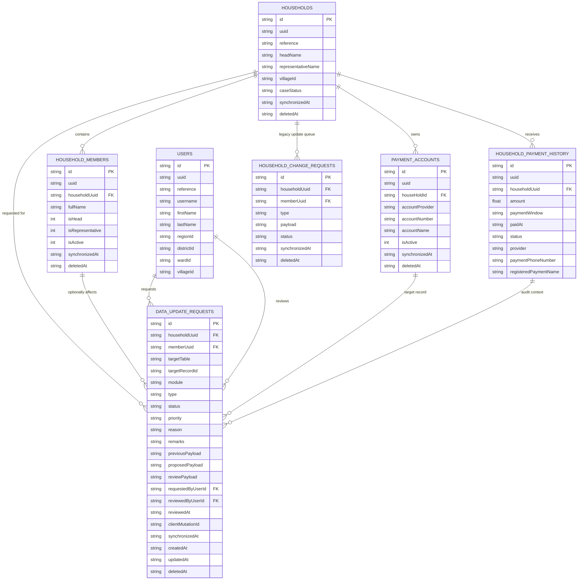
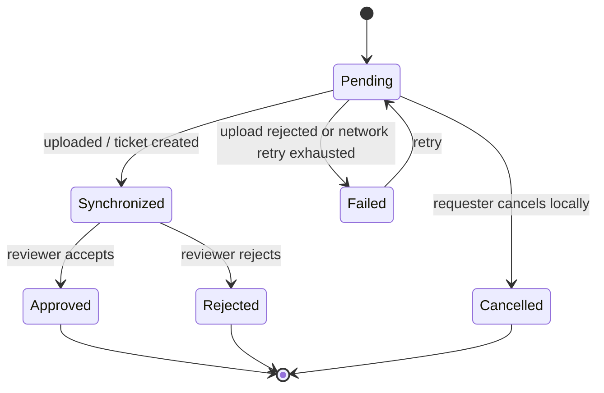

# Data Update Module ERD

Schema-only handoff for the mobile data update module. The current implementation
adds the `dataUpdateRequests` PowerSync table and TanStack DB collection, but it
does not yet route UI writes or PowerSync uploads through this table.

## Entity relationship diagram

## Relationship notes

| Relationship | Key | Notes |
|---|---|---|
| Household to data update request | `dataUpdateRequests.householdUuid` | Required for household-scoped update worklists, dashboards, and sync filters. |
| Member to data update request | `dataUpdateRequests.memberUuid` | Nullable. Use when the update targets a beneficiary, household head, representative, or member status. |
| User to data update request | `requestedByUserId`, `reviewedByUserId` | Nullable until authentication or review context is available. Store local user `id` unless the backend requires `uuid` or `reference`. |
| Polymorphic target | `targetTable`, `targetRecordId` | Points to the record being changed, such as `paymentAccounts` plus a payment account `id`. |
| Payload snapshots | `previousPayload`, `proposedPayload`, `reviewPayload` | JSON strings. Keep them small and domain-specific; do not duplicate full household records. |
| Legacy queue | `householdChangeRequests` | Existing household/payment audit flows still use this table. Migrate only after the new upload route is agreed. |

## Indexed access paths

`dataUpdateRequests` includes indexes for:

- Household worklists: `householdUuid`
- Member-specific work: `memberUuid`
- Polymorphic target lookup: `targetTable`, `targetRecordId`
- Module and request filtering: `module`, `type`, `status`
- Idempotent upload or ticket matching: `clientMutationId`
- Chronological pending queues: `createdAt`

## Status lifecycle

Recommended lifecycle for the first integration:

Use the existing project strings `Pending` and `Synchronized` for compatibility
with current sync banners. Add `Failed`, `Approved`, `Rejected`, and `Cancelled`
only when the backend workflow supports them.
